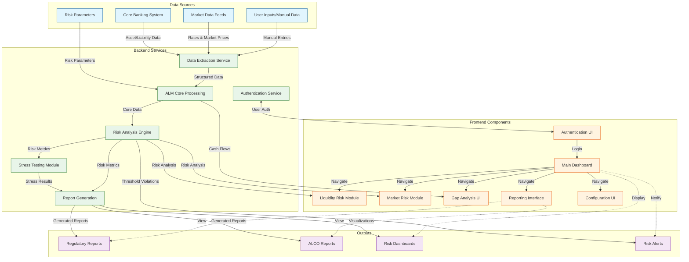

# ALM System Data Flow Architecture

The following diagram illustrates the data flow architecture of the Asset Liability Management (ALM) system:

## Key Components Explained

### Data Sources
- **Core Banking System**: Provides asset and liability data including loans, deposits, and investments
- **Market Data Feeds**: External market rates, yield curves, FX rates
- **Risk Parameters**: Configuration of risk thresholds, models, and appetite parameters
- **User Inputs**: Manual adjustments, assumptions, and scenario definitions

### Backend Services
- **Data Extraction Service**: Retrieves and transforms data from various sources
- **ALM Core Processing**: Central processing for asset-liability matching, gap analysis, etc.
- **Risk Analysis Engine**: Performs risk calculations (liquidity, interest rate, market risks)
- **Stress Testing Module**: Applies stress scenarios to assess resilience
- **Report Generation**: Creates regulatory and management reports
- **Authentication Service**: Manages user authentication and authorization

### Frontend Components
- **Authentication UI**: User login and account management
- **Main Dashboard**: Overview of key risk metrics and indicators
- **Liquidity Risk Module**: Detailed liquidity risk management interface
- **Market Risk Module**: Market and interest rate risk management
- **Gap Analysis UI**: Visualization of asset-liability gaps
- **Reporting Interface**: Report generation and viewing
- **Configuration UI**: System configuration and parameters

### Outputs
- **Regulatory Reports**: Basel III and BCT compliance reports
- **ALCO Reports**: Reports for Asset Liability Committee
- **Risk Dashboards**: Visual representations of risk positions
- **Risk Alerts**: Notifications for threshold breaches

## Data Flow Process

1. Data is collected from various sources (Core Banking, Market Data, etc.)
2. The backend processes this data through various analytical engines
3. Results are stored and made available to the frontend components
4. Users interact with the frontend to view reports, analyze risks, and configure the system
5. The system generates outputs in the form of reports, dashboards, and alerts

This architecture supports the key functional requirements including gap analysis, stress testing, risk management, and regulatory reporting.
